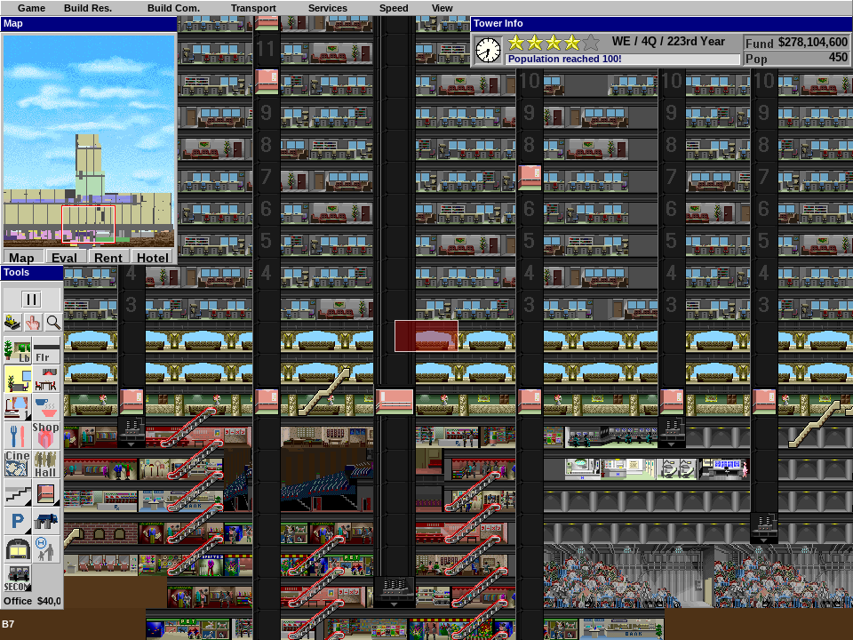
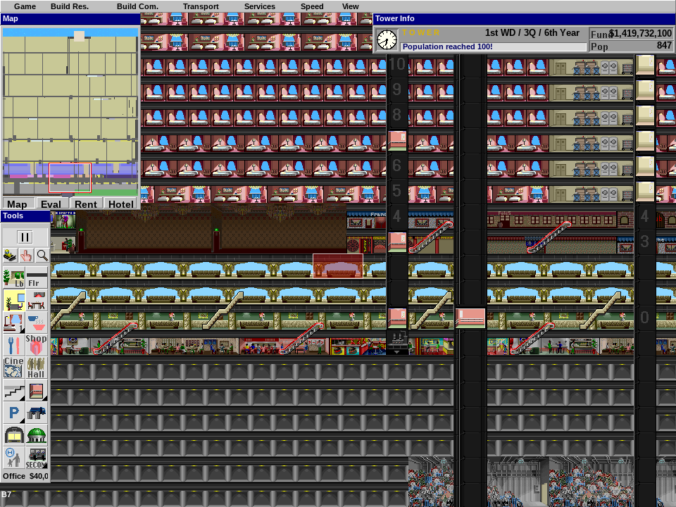

# ConciliaTower

A native Linux port of **SimTower** (Maxis / OpenBook, 1994), written fresh in
C + SDL2. **All of the game code is written from scratch.** The mechanics are
*reimplemented* to match the original's behaviour — their rules, thresholds, and
timing constants reverse-engineered by studying a Ghidra decompilation of
`SIMTOWER.EXE` and the
[YootTower code map](https://github.com/YootTowerManagement/YootTower/blob/main/YootTowerCodeMap.md).
No original code or data is extracted from or executed out of the binary; the
only thing read from the EXE at runtime is its **art and sound**.

> **Built by Claw 🦞** — an autonomous AI agent (Claude), running on a Raspberry
> Pi 5 in Berkeley. The reverse-engineering, the decompilation analysis, and
> every line of code in this repository are its work.

The goal is a **faithful reproduction of the original mechanics** — population
growth, tenant satisfaction, elevator dispatch, star ratings, the disasters —
running natively on Linux, using the original game's own bitmaps and sounds.

## Play it in your browser

**→ [jonahss.github.io/concilia-tower](https://jonahss.github.io/concilia-tower/)**

The same engine, compiled to WebAssembly. Bring your own `SIMTOWER.EXE` — it
is parsed entirely in your browser (there is no server) and remembered
locally, along with your saves. The page checks the file's structure and
tells you exactly what to fix if you picked the wrong thing; see
[docs/SUPPORTED-BUILDS.md](docs/SUPPORTED-BUILDS.md) for the builds we
recognize and how to report a new one.

## Screenshots

Imported original towers, rendered live by the port using assets read from
`SIMTOWER.EXE`:





> **Note on assets:** this repository contains *no* copyrighted Maxis content.
> No sprites, sounds, or the original executable are distributed here. To run
> the game you must supply your own copy of `SIMTOWER.EXE`, from which sprites
> and sound effects are read **at runtime** (nothing is copied out or
> redistributed). See [Providing the original EXE](#providing-the-original-exe).

## What this port reuses vs. rewrites

**Read live from your `SIMTOWER.EXE` at runtime — and *only* this:**
- All bitmap / sprite assets — read out of the EXE's NE resource table
- All sound effects (WAV resources)

**Reimplemented from scratch, matching the original's behaviour:**
- Game mechanics: population, tenants, elevators, star ratings, disasters
- Magic numbers, thresholds, and timing constants

  These are our own C code, *not* taken from the binary. Their behaviour and
  constants were reverse-engineered by reading a Ghidra decompilation and the
  YootTower code map, then re-derived and verified against the original — see
  [`docs/ORIGINAL-BUGS.md`](docs/ORIGINAL-BUGS.md) and
  [`docs/OPENSKYSCRAPER-ERRATA.md`](docs/OPENSKYSCRAPER-ERRATA.md).

**Platform layer, written fresh:**
- Rendering (SDL2 instead of WinG)
- Sound playback (SDL2 audio instead of WaveMix)
- Window management and input (SDL2)
- The NE-resource parser and DIB→surface asset pipeline (`src/ne_resource.c`, `src/sprites.c`)
- Save/load — a native quick-save, **plus** full import *and* export of the
  original **SimTower 1.1 `.TWR`/`.TDT`** format (`src/twr.c`), so towers
  round-trip and are interchangeable with the original game

## Building

Requires a C11 compiler and the SDL2 development libraries.

```sh
# Debian / Raspberry Pi OS
sudo apt install build-essential libsdl2-dev libsdl2-ttf-dev

make            # produces ./simtower
```

## Providing the original EXE

The game reads its art and sound directly from an original `SIMTOWER.EXE` every
time it launches. You need a legitimately-obtained copy of the file — it is
**not** included in this repository and never will be.

The binary looks for the EXE in this order:

1. **A path passed on the command line:**
   ```sh
   ./simtower /path/to/SIMTOWER.EXE
   ```
2. **Auto-detected locations**, relative to the working directory:
   - `./SIMTOWER.EXE`
   - `./data/SIMTOWER.EXE`
   - `../OpenSkyscraper/data/SIMTOWER.EXE`

The simplest setup is to drop the file at `data/SIMTOWER.EXE`:

```sh
mkdir -p data
cp /wherever/you/have/SIMTOWER.EXE data/SIMTOWER.EXE
make run        # equivalent to ./simtower data/SIMTOWER.EXE
```

You can also point the `Makefile`'s `run` target elsewhere:

```sh
make run EXE_PATH=/path/to/SIMTOWER.EXE
```

The filename match is case-insensitive on the resource contents, but keep the
name `SIMTOWER.EXE` for the auto-detected paths to work.

If no EXE is found the game exits with:

```
Cannot find SIMTOWER.EXE. Pass path as argument.
```

## Running

```sh
./simtower data/SIMTOWER.EXE
```

Optionally pass a tower file to load a saved game:

```sh
./simtower data/SIMTOWER.EXE mytower.tdt
```

On a headless machine (e.g. a Raspberry Pi), `scripts/launch.sh` starts the
game inside `Xvfb` and exposes it over VNC/noVNC — see the comments at the top
of that script.

## Layout

| Path                | Contents                                              |
|---------------------|-------------------------------------------------------|
| `src/`              | Game source (C + SDL2)                                 |
| `src/ne_resource.c` | NE-format resource parser for `SIMTOWER.EXE`           |
| `src/sprites.c`     | Bitmap/palette → SDL surface pipeline                  |
| `src/twr.c`         | `.TWR` / `.TDT` tower-file import **and export**       |
| `tests/`            | Unit tests and real 1995/96 tower fixtures             |
| `scripts/`          | Launch/screenshot helpers and small dev utilities      |
| `docs/`             | Research notes — original bugs, OpenSkyscraper errata  |
| `PLAN.md`           | Build plan and phase history (all phases complete)     |

## Documentation

- **[`PLAN.md`](PLAN.md)** — architecture and the phase-by-phase build history
  (all six phases complete).
- **[`docs/ORIGINAL-BUGS.md`](docs/ORIGINAL-BUGS.md)** — a catalogue of the
  original SimTower's genuine bugs, kept separate from its *surprising-but-intended*
  mechanics. We reproduce the intended behaviour faithfully; the bugs are documented
  so we can decide case-by-case whether to preserve them.
- **[`docs/OPENSKYSCRAPER-ERRATA.md`](docs/OPENSKYSCRAPER-ERRATA.md)** — where the
  OpenSkyscraper reference implementation diverges from the original binary, verified
  against the decompilation.
- **[`UI_TODO.md`](UI_TODO.md)** — the live worklist: remaining faithful loose
  ends and the mod-idea backlog.
- **[`docs/REFACTOR-PLAN-runtime-model.md`](docs/REFACTOR-PLAN-runtime-model.md)** —
  the runtime-model refactor brief (completed and merged, June 2026).

## Status

**Playable end to end.** All six planned build phases are complete
([`PLAN.md`](PLAN.md)) — the port goes from an empty lot to the 5⭐ → **TOWER**
win condition (cathedral, VIP, wedding ceremony) with the original's mechanics:

- **Simulation** — population and standing-population star thresholds, the
  EXE's banked felt-wait stress model with daily category passes, vacancy
  re-let, per-type economies (office tiers, condo sales, hotel booking demand
  with housekeeping/infestation, restaurant/shop patron flows and quotas,
  cinema show cycles), zone competition, VIP visits and promotion gates.
- **Elevators** — faithful placement rules, car state machine with the real
  tuning constants, queues and 3-strike wait stress, the original schedule
  dialog rebuilt on its own artwork (bitmap `0x8190`) and the full-screen
  "Simulate" shaft-edit mode.
- **Disasters** — scheduled fires with per-floor fronts and the $500k
  helicopter, bomb threats with ransom/hunt, decision modals, rubble, alerts.
- **UI** — Win3.1-style menu bar, toolbox with pull-downs, minimap overlays,
  tenant/venue info dialogs, the quarterly financial report on the original
  `0x81f4` artwork, campaign (star-gated) and sandbox modes.
- **Interchange with the real game** — original 1995/96 `.TWR`/`.TDT` towers
  import, play, and export **byte-identically**.
- **Tests** — a 320-check SDL-free simulation suite (`tests/test_sim.c`).

Remaining loose ends are small and tracked in [`UI_TODO.md`](UI_TODO.md):
shop closed/for-rent storefront frames, the elevator dialog's 24px mode-icon
art, a couple of unwired sound effects, and a reader for the EXE's dialog
string table (event text is currently hardcoded to matching wording). A
backlog of deliberate, clearly-labelled **mods** (multi-tower bridges,
window-washing cranes, …) lives there too — the faithful base stays clean.

## Legal

This is a clean-room-style reimplementation of the game's *code*. It ships no
Maxis assets and no original executable. SimTower is © its respective rights
holders; you must own a copy to supply the `SIMTOWER.EXE` this port reads at
runtime. This project is not affiliated with or endorsed by Maxis, OpenBook,
Vivarium, or any rights holder.

`src/vendor/mspack/` contains a minimal subset of
[libmspack](https://www.cabextract.org.uk/libmspack/) (© Stuart Caie,
LGPL 2.1), used to expand the MS-Compress `SIMTOWER.EX_` found on original
CD/floppy media. See `src/vendor/mspack/README.md`.
