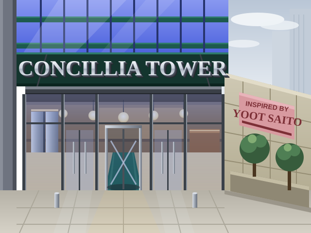

# Landing-page hero art

`hero.svg` is the source of `web/hero.png` — an original illustration of a
contemporary tower entrance, composed in the visual language of SimTower's
1994 splash screen (sign band with extruded serif letters, entrance glass
with the lobby glowing through, tribute plaque, twin planter trees). It is
NOT derived from any Maxis bitmap; the page must stay clean of the game's
own assets.

Regenerate after editing the SVG (needs chromium + PIL/numpy):

    # rasterize (window is taller than the art: this chromium build eats
    # ~85px of the declared window height, so render big and crop)
    printf '<!doctype html><html><head></head><body></body></html>' > /tmp/wrap.html
    cp web/art/hero.svg /tmp/hero.svg
    chromium --headless --disable-gpu --screenshot=/tmp/big.png --window-size=800,700 --hide-scrollbars /tmp/wrap.html
    python3 -c "from PIL import Image; Image.open('/tmp/big.png').convert('RGB').crop((0,0,640,480)).save('/tmp/raw.png')"
    # 1994-ify: Bayer ordered dither + adaptive palette
    python3 web/art/dither.py /tmp/raw.png web/hero.png 96 12

Text uses Liberation Serif/Sans (present on the Pi and in CI images).
